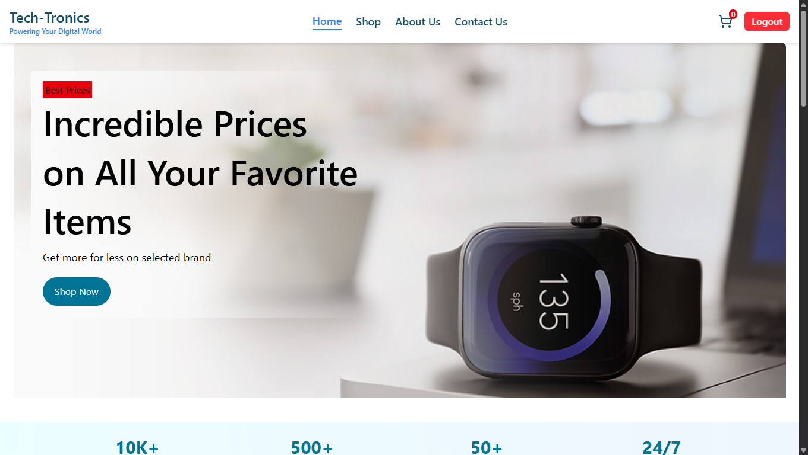

# 🛒 Tech-Tronics E-Commerce Website

**`Tech-Tronics`** is a full-stack e-commerce application with a **React frontend** and a **Flask backend**.  
It includes product browsing, cart management, checkout, authentication, authorization, and admin controls.

---

## 📸 Project Preview



---

## 🚀 Why This Project Is Useful

- 🧩 Practical full-stack reference using React + Flask  
- 🔄 Clean frontend/backend separation  
- 🛍️ Complete shopping flow (auth → cart → checkout)  
- 🛠️ Admin dashboard for product & order management  
- ⚙️ Environment-based configuration for scalability  

---

## 📌 Overview

This repository contains two main applications:

- **FrontEnd** → Customer-facing React app  
- **BackEnd** → Flask REST API  

---

## ✨ Core Features

- 🔐 JWT-based authentication (signup/login)  
- 🛒 Cart management (add/update/remove items)  
- 🏷️ Product browsing with categories  
- 💳 Checkout & order history  
- 🛠️ Admin product CRUD operations  
- 📦 Order tracking & status updates  
- 📱 Responsive UI with animations  

---

## 🧰 Tech Stack

### 🎨 Frontend
- React 19  
- Vite  
- React Router  
- Tailwind CSS  
- react-toastify  
- jwt-decode  
- lucide-react  
- framer-motion  

### ⚙️ Backend
- Flask  
- Flask-CORS  
- Flask-SQLAlchemy  
- Flask-JWT-Extended  
- Flask-Bcrypt  
- PyMySQL  
- python-dotenv  
- Supabase Python client  

---

## 📁 Repository Structure
```text
ECommerce Website/
├─ BackEnd/
│  ├─ __pycache__/
│  ├─ instance/
│  │  └─ Database.db
│  ├─ models/
│  ├─ routes/
│  ├─ app.py
│  ├─ config.py
│  ├─ extensions.py
│  ├─ requirements.txt
│  └─ supabase_client.py
├─ FrontEnd/
│  ├─ public/
│  ├─ src/
│  │  ├─ assets/
│  │  ├─ components/
│  │  ├─ config/
│  │  ├─ data/
│  │  ├─ Pages/
│  │  │  ├─ Auth/
│  │  │  ├─ Body/
│  │  │  ├─ Context/
│  │  │  ├─ Footer/
│  │  │  └─ Header/
│  │  ├─ App.css
│  │  ├─ App.jsx
│  │  ├─ index.css
│  │  └─ main.jsx
│  ├─ .gitignore
│  ├─ eslint.config.js
│  ├─ index.html
│  ├─ package-lock.json
│  ├─ package.json
│  └─ vite.config.js
└─ .gitignore
```
---

## 🌐 Frontend Highlights

* Main routes → `FrontEnd/src/App.jsx`
* API config → `FrontEnd/src/config/api.js`
* Auth pages → `Pages/Auth`
* Store pages → `Pages/Body`
* Cart state → Context API

---

## 🔧 Backend Highlights

* Entry point → `BackEnd/app.py`
* Config → `BackEnd/config.py`
* Models → `BackEnd/models`
* Routes → `BackEnd/routes`
* Image storage → Supabase

---

## 🔌 API Modules

* `/auth` → Authentication
* `/product` → Product CRUD
* `/order` → Cart operations
* `/checkout` → Orders & history

---

## ⚡ Getting Started

### 1️⃣ Clone the Repository

```bash
git clone <your-repository-url>
cd "ECommerce Website"
```

---

### 2️⃣ Backend Setup

```bash
cd BackEnd
copy .env.example .env
pip install -r requirements.txt
```

Update `.env` with your credentials:

* DATABASE_URL
* JWT_SECRET_KEY
* SUPABASE_URL
* SUPABASE_SERVICE_ROLE_KEY

Run server:

```bash
python app.py
```

---

### 3️⃣ Frontend Setup

```bash
cd FrontEnd
copy .env.example .env
npm install
```

Set API URL:

```env
VITE_API_BASE_URL=http://localhost:5000 (or your-cloud-backend-url)
```

Run app:

```bash
npm run dev
```

---

## 🛠️ Available Commands

### Frontend

```bash
npm run dev
npm run build
npm run lint
npm run preview
```

### Backend

```bash
python app.py
```

---

## 🔄 Typical Workflow

1. Start backend
2. Start frontend
3. Open browser
4. Login / Signup
5. Shop & checkout

---

## 🔐 Authentication

* JWT stored in `localStorage`
* Role-based UI (admin/user)
* Navbar updates dynamically

---

## 📝 Notes for Development

* Default backend → `auto generated by cloud`
* DB tables auto-created
* Supabase used for image storage
* CORS configured via `.env`

---

## 📌 Current Project Notes

* Frontend README still default Vite
* No automated tests yet
* Review `.env.example` before use

---

## 🚀 Deployment Considerations

* 🔒 Secure environment variables
* 🌍 Restrict CORS origins
* 🗄️ Use production database
* ☁️ Configure Supabase permissions

## 🌐 Live Demo

🚀 Experience the project live here:  
👉 [Tech-Tronics E-Commerce](https://ecommerce-frontend-chi-ten-25.vercel.app)
---
### To test admin feature
* **Email:** `smuzair14cse@gmail.com`
* **Password:** `1122`
---

⚠️ Note: The demo run on a free hosting tier, so initial load can take a few seconds.

---

## 💡 Feedback & Support

🐞 Spotted a bug?
💭 Have an idea?

👉 Open an issue anytime — contributions are welcome!

---

## 🙌 Closing Note

🙏 Thanks for checking this out.

💻 Happy coding! 🚀
🌱 Stay curious.

